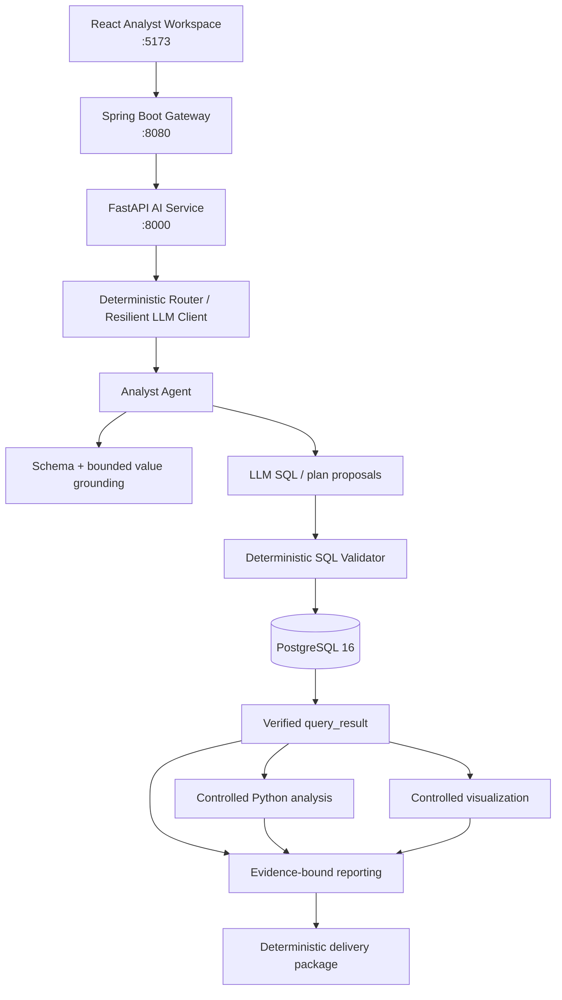

# 02 — Architecture

## Current runnable architecture



## Trust model

```text
LLM proposes.
Deterministic controls verify.
Only verified evidence is promoted into trusted artifacts.
```

The LLM is an interchangeable probabilistic component, not the database-security boundary and not the trusted-report boundary.

## Request flow

```text
question
→ schema + metadata grounding
→ deterministic route selection
→ LLM SQL proposal
→ SQL candidate (untrusted)
→ AST-based SQL validation
→ read-only PostgreSQL execution
→ query_result (verified evidence)
→ optional controlled analysis plan
→ optional controlled visualization plan
→ evidence-bound report assembly
→ deterministic delivery packaging
```

## Service boundaries

### React Analyst Workspace

The portfolio/demo UI exposes:

- natural-language analysis requests;
- explicit routing and fallback policy;
- optional validated manual SQL;
- schema inspection;
- model-generated Answer surface;
- verified Data / Analysis / Chart / Report / Provenance tabs;
- JSON and Markdown delivery downloads.

The UI explicitly distinguishes **LLM-generated** prose from **Verified report / Evidence-backed** artifacts.

### Spring Boot Gateway

The Gateway is the application edge. It proxies health, schema, query, and analyze operations and propagates trace IDs. It also owns the browser-facing CORS configuration.

Authentication, users, persistent conversations, and distributed rate limiting are intentionally outside the current P1 scope.

### FastAPI AI Service

FastAPI hosts:

- schema and deterministic query APIs;
- routing/fallback policy execution;
- the provider-independent LLM client boundary;
- Analyst Agent orchestration;
- SQL validation and read-only execution;
- controlled Python analysis;
- controlled visualization;
- evidence-bound reporting;
- deterministic delivery packaging;
- structured observability;
- evaluation and acceptance support.

### PostgreSQL

PostgreSQL stores the reproducible analytical fixture and metadata. Analyst SQL runs in read-only transactions with statement timeout and result-row limits.

## Model-provider boundary

```text
Analyst Agent
    ↓
Deterministic Router
    ↓
Resilient LLM Client
    ├── deterministic Mock
    ├── OpenAI-compatible remote route
    └── Ollama / local route
```

Routing is deterministic and outside the model. Privacy-sensitive local requests do not silently cross to a remote provider unless cross-route fallback is explicitly allowed.

## SQL security boundary

Generated SQL is untrusted. Before execution, deterministic policy checks enforce:

- one statement only;
- read-only `SELECT` / `WITH ... SELECT`;
- physical-table allowlist;
- public-schema restrictions;
- comment / `SELECT INTO` / row-lock rejection;
- SQL-length limits;
- read-only database transaction;
- statement timeout;
- result-row cap.

The model cannot bypass this validator by instruction.

## Controlled analysis boundary

The application does not execute arbitrary model-generated Python. The model can only propose structured operations from an allowlist currently containing:

- descriptive statistics;
- Pearson correlation;
- percent change.

Plans are validated against verified query columns and bounded result sizes before deterministic Python code executes them.

## Visualization boundary

The model proposes a structured chart plan; application code validates chart type and referenced verified columns, then emits a chart artifact. The browser renders the artifact. There is no model-generated JavaScript or plotting program in the trusted execution path.

## Reporting and delivery boundary

Conversational LLM prose is not automatically trusted as report evidence.

Verified reports are assembled from:

- `query_result`;
- controlled `analysis_result`;
- optional validated `chart_artifact`.

The delivery layer then produces deterministic JSON / Markdown output with provenance. Unsupported model prose remains on the conversational Answer surface and does not silently enter the verified report.

## Runtime / production baseline

Current local runtime hardening includes:

- loopback-only published ports by default;
- environment-based database / CORS / provider settings;
- `.env` exclusion from Git and Docker context;
- structured-log secret redaction;
- non-root FastAPI / ETL / Gateway / Web containers;
- health-gated startup;
- locked frontend dependency installation through `npm ci`;
- deterministic `make verify` production baseline.

## Why one Analyst Agent

P1 intentionally keeps one Analyst Agent rather than introducing multi-agent orchestration for its own sake. A more complex agent topology should only be introduced if measured evaluation shows a concrete failure mode that cannot be addressed more simply.
