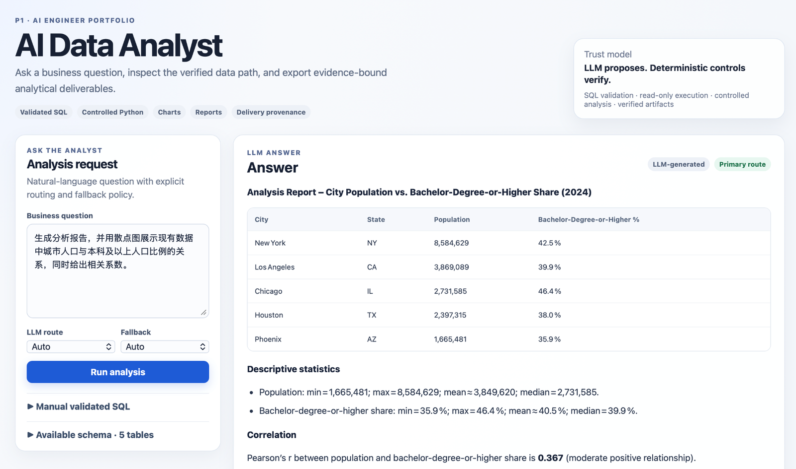
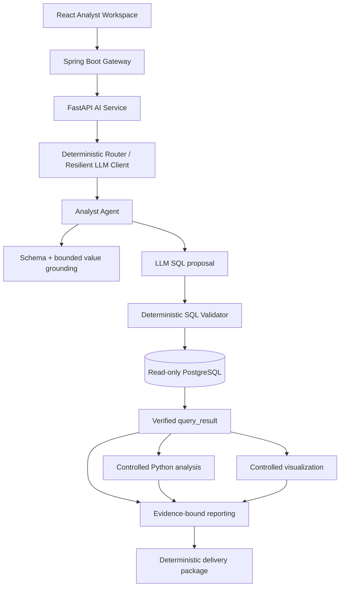
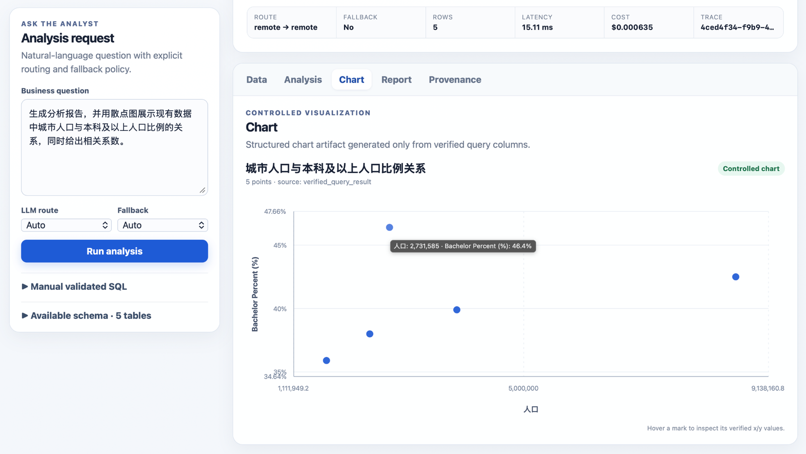
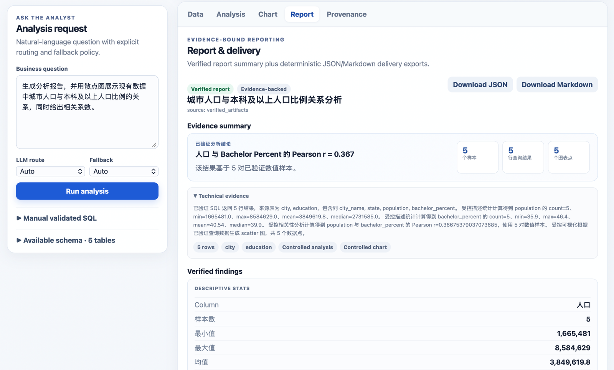
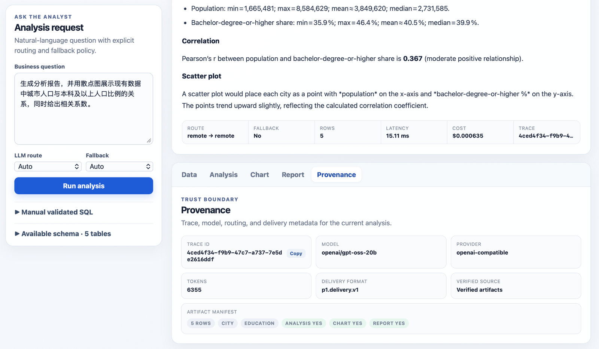

# P1 — AI Data Analyst Platform

Production-oriented AI application engineering portfolio project.

P1 turns a natural-language analytics question into **validated SQL, read-only query evidence, controlled analysis, charts, reports, and deterministic delivery artifacts**. The core engineering goal is not merely to make an LLM generate SQL; it is to keep probabilistic model output behind deterministic security and evidence boundaries.



## Why this project exists

A prompt-to-SQL demo is easy to build and easy to over-trust. P1 is designed around a stricter contract:

```text
LLM proposes.
Deterministic controls verify.
PostgreSQL produces evidence.
Only verified artifacts enter trusted reporting and delivery.
```

The system demonstrates the kinds of concerns expected in an AI application / AI engineer role: provider abstraction, SQL safety, routing and fallback, controlled tool use, evaluation, observability, deterministic evidence, frontend integration, security hardening, and repeatable local verification.

## Architecture



The primary execution path is:

```text
question
→ schema / metadata grounding
→ LLM SQL proposal
→ deterministic SQL validation
→ read-only PostgreSQL
→ verified query evidence
→ optional controlled analysis / visualization
→ evidence-bound report
→ deterministic delivery package
```

See [`02-architecture.md`](02-architecture.md) for service boundaries and trust boundaries.

## What is implemented

- **React + Vite Analyst Workspace** with Data, Analysis, Chart, Report, and Provenance views.
- **Spring Boot Gateway** for the public application API and trace propagation.
- **FastAPI Analyst Agent** with provider-independent LLM integration.
- **Deterministic routing / fallback** across remote and local model routes.
- **AST-based SQL validation** with table allowlists, read-only enforcement, timeout, and row caps.
- **Bounded value grounding** for selected stored category values.
- **Controlled Python analysis** for allowlisted descriptive statistics, Pearson correlation, and percent change.
- **Controlled visualization** using validated chart artifacts rather than model-generated plotting code.
- **Evidence-bound reporting** that excludes unsupported LLM prose from verified report facts.
- **Deterministic JSON / Markdown delivery packaging** with provenance.
- **Evaluation + acceptance harnesses** for model quality and stable product contracts.
- **Structured observability** with trace IDs, latency, route, token, and estimated-cost telemetry.
- **Security/configuration hardening**: loopback-only published ports, secret-safe configuration, structured-log redaction, and non-root application containers.

## Demo surfaces

### Controlled analysis + chart



### Evidence-bound report



### Provenance



A repeatable 5–7 minute walkthrough is documented in [`docs/DEMO.md`](docs/DEMO.md).

Repository publication metadata is prepared in [`docs/GITHUB-METADATA.md`](docs/GITHUB-METADATA.md), and final screenshot/video capture guidance is in [`docs/DEMO-CAPTURE-CHECKLIST.md`](docs/DEMO-CAPTURE-CHECKLIST.md).

## Trust boundaries

### Generated SQL is untrusted

LLM-generated SQL is never executed directly. The validator enforces, among other controls:

- exactly one statement;
- `SELECT` / `WITH ... SELECT` only;
- schema and physical-table allowlists;
- CTE-aware table extraction;
- no SQL comments;
- no `SELECT INTO`;
- no row-locking reads;
- read-only PostgreSQL transaction;
- statement timeout;
- SQL length and result-row caps;
- structured rejection codes.

### Controlled analysis is not arbitrary code execution

The model may propose a small structured analysis plan, but application code validates and executes only allowlisted operations. There is no model-controlled `eval`, `exec`, shell, filesystem, network, or arbitrary import path.

### Verified reports do not trust free-form LLM claims

The conversational **LLM Answer** is intentionally separated from **Verified artifacts**. Verified report summaries and delivery packages are assembled from deterministic query, analysis, and chart evidence. Free-form LLM prose cannot silently become trusted report evidence.

## Technology stack

| Layer | Technology |
|---|---|
| Frontend | React 19 + Vite |
| API Gateway | Java 21 + Spring Boot |
| AI service | Python + FastAPI + Pydantic |
| Database | PostgreSQL 16 |
| SQL parsing / policy | SQLGlot |
| Model integration | Provider-independent `LLMClient`, OpenAI-compatible adapter, Ollama/local route, deterministic Mock |
| Evaluation | Python + JSON Schema + deterministic evaluators |
| Runtime | Docker Compose |
| Verification | pytest, Node built-in test runner, Vite production build, acceptance runner |

## Quick start

Prerequisites:

- Docker with Docker Compose;
- `uv` for host-side Python commands;
- no model API key is required for the default deterministic Mock configuration.

```bash
cp .env.example .env
make verify
```

`make verify` is the deterministic local production gate. It validates security-sensitive configuration, Docker Compose, the full stack build/start, non-root runtime identities, backend tests, frontend deterministic tests, frontend production build, and Gateway health.

Open the UI:

```text
http://localhost:5173
```

The published local ports are loopback-only by default.

## Real-model configuration

Default deterministic development mode:

```env
LLM_PROVIDER=mock
```

An OpenAI-compatible route can be configured through `.env`:

```env
LLM_PROVIDER=openai-compatible
LLM_BASE_URL=https://your-compatible-endpoint.example/v1
LLM_API_KEY=...
LLM_MODEL=your-model
```

Routing supports `auto`, `remote`, and `local`, with privacy-aware fallback behavior validated during Phase 2. See the Phase 2 documentation for the measured routing and fallback policy.

## Measured evaluation and acceptance

### Real-model comparison

Phase 2 used the same evaluation harness to compare a remote Groq / GPT-OSS 20B route with a local Ollama / Qwen3 8B route.

| Metric | Groq / GPT-OSS 20B | Ollama / Qwen3 8B |
|---|---:|---:|
| Completed | 30 / 30 | 24 / 30 |
| End-to-end semantic | 96.7% | 73.3% |
| Completed-case semantic | 96.7% | 91.7% |
| Avg completed latency | 2.53 s | 65.95 s |
| P95 completed latency | 2.94 s | 116.30 s |
| API cost for 30-case run | ~$0.00647 | $0 |

The historical deterministic Mock baseline is intentionally low because the Mock provider is an engineering fixture rather than a language-model quality benchmark.

### Phase 3 integrated acceptance

Final integrated verification passed:

```text
FastAPI / Python regression suite    PASS (100%)
Frontend deterministic tests         PASS (4/4)
Frontend production build            PASS
Real-stack acceptance                PASS (7/7)
```

The 7-case acceptance suite covers Gateway health, unsafe SQL rejection, ranked query execution, controlled descriptive statistics, controlled visualization, evidence-bound report/delivery, and the full controlled analysis chain.

Run it separately from the deterministic local gate because it can depend on a configured real-model route:

```bash
make acceptance
```

Reports are written to `acceptance/results/`.

## Example end-to-end scenario

A useful portfolio demo question is:

```text
生成分析报告，并用散点图展示现有数据中城市人口与本科及以上人口比例的关系，同时给出相关系数。
```

The verified pipeline returns:

- query rows for five cities;
- controlled descriptive statistics;
- Pearson correlation `r ≈ 0.367`;
- a controlled scatter chart;
- an evidence-bound report;
- provenance and deterministic JSON / Markdown delivery artifacts.

The exact LLM wording may vary; the trusted artifacts are bound to deterministic evidence.

## Sample analytical fixture

The checked-in fixture is intentionally small and reproducible while covering multiple grains and years:

| Table | Rows | Year | Grain |
|---|---:|---:|---|
| `city` | 15 | 2025 | place |
| `education` | 5 | 2024 | ACS place |
| `economic_indicator` | 10 | 2024 | ACS place |
| `employment` | 5 | 2023 | OEWS metro |
| `salary` | 5 | 2023 | OEWS metro |

The fixture is suitable for deterministic portfolio demonstrations; it is not intended to represent a production warehouse.

## Repository structure

```text
ai-data-analyst/
├── ai/analyst/              # FastAPI, Agent, LLM client, SQL policy, controlled tools
├── backend/springboot/      # Java gateway
├── frontend/web/            # React Analyst Workspace
├── db/                      # database / metadata assets
├── etl/                     # sample-data loading
├── evaluation/              # model-quality evaluation harness
├── acceptance/              # stable product-contract acceptance suite
├── tests/                   # Python regression tests
├── scripts/                 # verification / security utilities
├── docs/                    # architecture, phase notes, demo, portfolio material
├── docker-compose.yml
├── Makefile
├── PROJECT-CONTEXT.md       # detailed implementation source of truth
└── README.md
```

## Verification commands

```bash
make verify          # deterministic local production gate
make acceptance      # real-stack / real-route acceptance
make test            # Python regression suite
make web-test        # deterministic frontend tests
make web-build       # frontend production build
make security-check  # host security/configuration checks
```

Host-side Python commands use `uv run python`. Web dependencies are locked with `frontend/web/package-lock.json`, and Web Docker builds use `npm ci`.

## Current security / configuration baseline

- published development ports bind to `127.0.0.1` by default;
- `.env` is excluded from Git and Docker build context;
- database, CORS, routing, and provider settings are environment-configurable;
- structured logs redact secret-bearing fields;
- FastAPI, ETL, Gateway, and Web run as non-root users;
- PostgreSQL retains the official image user model;
- `make verify` includes static security checks and runtime UID validation.

## Known limitations

- The dataset is a small portfolio fixture, not a general analytics warehouse.
- Authentication, multi-user authorization, persistent conversations, and distributed rate limiting are not implemented.
- Controlled Python analysis intentionally supports only a small allowlist of operations.
- Chart artifacts do not currently carry arbitrary point-label metadata; the UI does not infer labels that are absent from verified chart evidence.
- Model quality still depends on the configured provider and prompt behavior; deterministic controls limit what the model can execute or promote into trusted artifacts, but they do not make model prose infallible.
- Public cloud deployment and GitHub CI are intentionally deferred to later Phase 4 stages.

## Project status

```text
Phase 1 — MVP Foundation                         CLOSED
Phase 2 — Real LLM Evaluation / Routing / Cost  CLOSED
Phase 3 — Evidence-backed Analysis               CLOSED
Phase 4 — Production / Portfolio Readiness       ACTIVE

Stage 4.1 — Local Production Baseline            CLOSED
Stage 4.2 — Security / Configuration Cleanup     CLOSED
Stage 4.3 — Portfolio Documentation & Demo       ACTIVE
Stage 4.4 — GitHub Repository & CI               planned
Stage 4.5 — Deployment / Final Release           planned
```

Detailed development history and frozen engineering decisions are maintained in [`PROJECT-CONTEXT.md`](PROJECT-CONTEXT.md).

## Portfolio / interview positioning

See [`docs/PORTFOLIO.md`](docs/PORTFOLIO.md) for concise resume bullets, a 60-second project explanation, deep-dive interview topics, and claims that should remain explicitly bounded by measured evidence.
